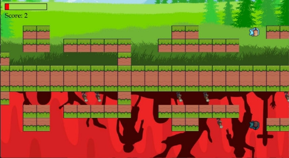

Nether Mirror

\- By THUG SHAKERS Dhruv and Nathan

*Our game is based on “Reflections always follow you”. It is a fairly simple game as we had problems starting off with the game. We had a lot of discord between each other, ultimately making us waste one-third of the hackathon time duration. However, the implementations were fairly complex as there are quite a few areas where we think logic was not easily implementable. Although we did not meet our expectations of how we wanted the game to turn out, it was a huge learning experience for us, on how to work together with good coordination and work under pressure, which we feel cannot be ever replicated if we hadn’t taken part in the hackathon. Overall, it was a fun learning experience.*

The main idea of the game is that it is a platformer that moves around a terrain in the overworld, and has a reflection of itself in a nether world.The main objective is to kill zombies in the nether world and get the highest possible score without dying as the zombies attack you back. While doing so, there are power-ups in the overworld which can give you boosts in the game such as a health regen powerup as well as a double damage powerup which inflicts literally double damage to the zombies. There is a distinct end to the game when you see that you can’t scroll through the map anymore. Also, you cannot scroll back to the place where you were coming from as we felt that that would be cheating the game.

As time was less, we could only implement the player to attack automatically when the zombie is nearby, but it is easy to change that to a keybind.

You can move left, right, jump and double jump (combo of jump).

The game can be run by executing the mainGameFinalWithComments.py file. Make sure all files from the github repo excluding mainGame.py and mainGameFinal.py are there on the system running it. Once executed, you will be directed into the following screen -

1. **Intro Screen**

*Here you can see that your preferred character can be selected. There is also an about page which is located as the first button and the play button is to its right. These buttons are dynamic, and darken when you float on it.*

**About Page**

2. **Playing the game**

   *Once the play button is hit, we can see the game in action.*

*Controls*

1. *Left Arrow Key - PLAYER LEFT*
1. *Right Arrow Key - PLAYER RIGHT*
1. *Space Bar - PLAYER JUMP*
1. *Space Bar \*2 - PLAYER DOUBLE JUMP*

*As it is apparent, the player is animated according to the movement that it is doing.*

This is an image of an animation of the character DOUBLE JUMPING

*Player has killed a few zombies, and updated score is displayed.*

*For simplicity, we have made an end for the character in the game. But the game was meant to be based on a highscore basis.*

**3. Game Over Screen**

*This happens when the player finally dies by the zombies.*

PROBLEM WE FACED -

1\.We could not implement infinite terrain, based on random

generation of blocks, as the random generation of blocks, which required a lot of logic and edge-case consideration.

CHALLENGES WE FACED -

1\.Lack of time due to improper coordination and planning at the

start, due to which we could not implement many other ideas that we had planned at the start like enemy animation and attack mechanics of the player.

2\.It was hard to mirror the terrain, character and the zombie.

TECHNOLOGIES USED IN THE GAME-

1. In pygame:

1\.pygame.transform - flipping, scaling etc.

2\.Pygame.display - used for displaying

3\.Pygame.mask - masking the objects and

4\.Pygame.image - to load the image from the directory 5.pygame.sprite - to use Sprite class and to handle collisions 6.Pygame.surface - creating a hitbox

7\.Pygame.Rect - making a rectangle

8\.pygame.time - to handle the time function in the game 9.pygame.key - input of keys 10. Pygame.mouse - input of mouse pointer coordinates

2. We also used GIMP to edit the sprites(flipping, adding fade, etc)

REFERENCES-

YT - techwithtim for the tutorials and sprites Vecteezy.com
